  

 

  

 

## About Me

- SDE Intern at **Galaxy.ai** — building config-driven UI systems and AI agent infrastructure
- B.Tech CSE @ **JIS College of Engineering** *(2022 – 2026 · GPA: 8.14)*
- Shipped a config-driven UI framework — new AI models go live on web & mobile with **zero UI code changes**
- Built an internal npm package of **15+ pure functions** for composable AI agent orchestration
- Designed a **Trigger.dev + Inngest** fallback architecture for resilient job processing

 

## Tech Stack

  

  
  
  
  
  
  
  
  

 

## Projects

<table>
<tr>
<td width="50%" valign="top">

### Spott
**Event platform with AI-powered workflows**

Real-time event discovery, creation & registration with role-based access. Gemini auto-generates structured descriptions. QR check-ins via Clerk + Convex.

   

</td>
<td width="50%" valign="top">

### PrepWise
**AI-powered voice mock interviews**

Voice-based interview sessions with real-time AI evaluation. Vapi AI handles conversation, Gemini scores responses, Firebase tracks history.

   

</td>
</tr>
</table>

 

## GitHub Stats

  
  

 

  

 

 

  

